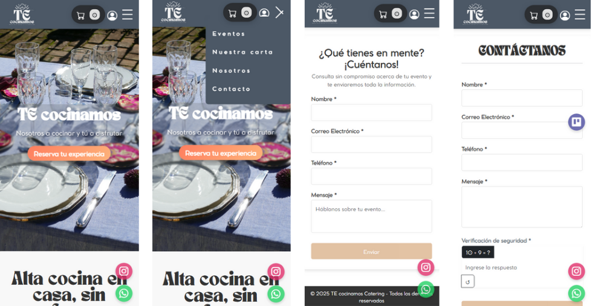
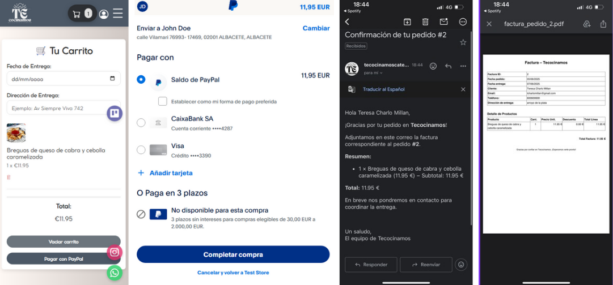

# 🧑‍🍳 TEcocinamos

> Plataforma Web de Gestión para Servicios de Catering

**Ciclo Formativo**: DAM (Desarrollo de Aplicaciones Multiplataforma)

**Alumno**: Teresa Charlo Millán

**Curso**: 2024–2025

---

---

**DOC WEB**: https://teita98.github.io/TEcocinamosTFG-DOCUMENTACION/

**WEB TEcocinamos**: https://mediumturquoise-duck-730938.hostingersite.com/

---

---

## Índice

1. [Introducción](#1-introducción)
2. [Funcionalidades y Tecnologías](#2-funcionalidades-y-tecnologías)
3. [Guía de Instalación](#3-guía-de-instalación)
4. [Cómo usar la aplicación](#4-cómo-usar-la-aplicación)
5. [Base de Datos & SQL](#5-base-de-datos-sql)
6. [Enlace a Figma](#6-enlace-a-figma)
7. [Conclusión](#7-conclusión)
8. [Contribuciones, Agradecimientos y Referencias](#8-contribuciones-agradecimientos-y-referencias)
9. [Licencia](#9-licencia)
10. [Contacto](#10-contacto)

---

## 1. Introducción

**Descripción del proyecto**

**TEcocinamos** nace de un negocio familiar con pasión por la cocina, transformado en una solución digital real para gestionar pedidos, ingredientes y clientes.

**Objetivos**

Digitalizar nuestro catering con una plataforma web diseñada para gestionar de forma integral los servicios de catering. Permite a usuarios consultar el catálogo de platos (con fotos, descripciones, precios, stock y alérgenos), realizar pedidos personalizados, reservar eventos y gestionar pagos. Incluye un panel de administración donde el personal interno (rol ADMIN) puede actualizar los productos, procesar pedidos, visualizar estadísticas y consultar registros de auditoría.

---

## 2. Funcionalidades y Tecnologías

#### Funcionalidades Principales

| Funcionalidad                     | Descripción                                                                                                                                  |
| --------------------------------- | -------------------------------------------------------------------------------------------------------------------------------------------- |
| Autenticación y seguridad         | Sistema con Spring Security + JWT, registro/login, rutas protegidas, roles diferenciados (CLIENTE / ADMIN).                                  |
| Catálogo de Platos e Ingredientes | Visualización, búsqueda, filtrado, detalle con imágenes, alérgenos, ingredientes, stock, y CRUD completo desde el panel ADMIN.               |
| Gestión de Pedidos y Estados      | Pedido online, generación automática de factura en PDF, actualización de estado y seguimiento, restauración de stock y auditoría de cambios. |
| Auditoría                         | Registro de operaciones importantes: cambio de estado, precios, bajas, cancelaciones, etc. Acceso desde panel administrador.                 |
| Estadísticas y análisis           | Top ventas, ingresos en rango de fechas, estado actual de pedidos en curso.                                                                  |
| Email y PDF automáticos           | Confirmaciones de pedido, respuestas a formularios, facturas adjuntas, bienvenida. Sistema SMTP integrado (Gmail).                           |
| Responsive & UX optimizada        | Interfaz adaptable, ligera, accesible y funcional en cualquier dispositivo.                                                                  |

#### Tecnologías Utilizadas

**Tecnologías empleadas:**

- Backend: Java 17 + Spring Boot (Security, JPA, Mail, JWT, Web, Validation, iText7)
- Frontend: Angular 17 + Tailwind CSS + ngx-toastr
- BBDD: MySQL 8 con índices, procedimientos, funciones y triggers
- CI/CD: Git + GitHub + GitHub Actions + Azure App Service
- Diseño: Figma

---

## 3. Guía de Instalación

### 3.1 Requisitos Previos

- **Java 17 (JDK)**
- **Maven 3.8+**
- **Node.js 18+** (+ NPM)
- **Angular CLI 17**
- **MySQL 8** (o acceso a un Azure MySQL Flexible Server)
- Cuenta de email para SMTP (Gmail con App Password o SendGrid)

---

### 3.2 Preparar la Base de Datos

1. Crear base de datos local (o en Azure MySQL):

   ```sql
   DROP DATABASE IF EXISTS tecocinamos;
   CREATE DATABASE tecocinamos CHARACTER SET utf8mb4 COLLATE utf8mb4_general_ci;
   USE tecocinamos;
   ```

2. Ejecutar **tecocinamos_schema.sql** (DDL), que crea tablas.

3. Ejecutar **tecocinamos_seed.sql** (inserción de datos de ejemplo).

---

### 3.3 Configurar Correo SMTP

En `src/main/resources/application.properties`, agregar configuración SMTP. Ejemplo con Gmail + App Password:

```properties
   # Nombre de la aplicación
   spring.application.name=tecocinamos-backend

   # DATOS DE CONEXIÓN A MYSQL
   spring.datasource.url=jdbc:mysql://localhost:3306/tecocinamos
   spring.datasource.username=${DB_USERNAME}
   spring.datasource.password=${DB_PASSWORD}

   # Modo de validación JPA: validate, update, create, create-drop
   spring.jpa.hibernate.ddl-auto=validate

   # Mostrar SQL en consola
   spring.jpa.show-sql=true
   spring.jpa.properties.hibernate.format_sql=true

   # CONFIGURACIÓN DE JWT
   # Debe coincidir con la clave de 256 bits (hex) que usas en JwtUtils
   jwt.secret=${JWT_SECRET}
   # Tiempo de expiración en milisegundos (ej. 3600000 = 1 hora)
   jwt.expiration=3600000

   # CONFIGURACIÓN DE CORREO (SMTP)
   spring.mail.host=smtp.gmail.com
   spring.mail.port=587
   spring.mail.username=tecocinamoscatering@gmail.com
   spring.mail.password=${MAIL_PASSWORD}
   spring.mail.protocol=smtp
   spring.mail.properties.mail.smtp.auth=true
   spring.mail.properties.mail.smtp.starttls.enable=true
   spring.mail.properties.mail.smtp.starttls.required=true
   spring.mail.properties.mail.debug=false
```

> **Obtener App Password (Gmail)**
>
> 1. Habilitar “Verificación en dos pasos” en la cuenta Google.
> 2. Ir a [myaccount.google.com/apppasswords](https://myaccount.google.com/apppasswords) y crear App Password (“TecocinamosBackend”).
> 3. Copiar la clave generada (16 dígitos, sin espacios) y pegar en `spring.mail.password`.

---

### 3.4 Ejecutar el Backend

1. Abrir terminal en la carpeta `tecocinamos-backend/`.

2. Compilar con Maven:

   ```bash
   mvn clean package
   ```

3. Ejecutar:

   ```bash
   mvn spring-boot:run
   ```

- El backend arrancará en `http://localhost:8080`.

---

### 3.5 Ejecutar el Frontend

1. Abrir terminal en la carpeta `tecocinamos-frontend/`.

2. Instalar dependencias:

   ```bash
   npm install
   ```

3. Iniciar servidor de desarrollo:

   ```bash
   ng serve
   ```

- El frontend arrancará en `http://localhost:4200`.
- En `src/environments/environment.ts`, configurar `base_url = 'http://localhost:8080'`.

---

## 4. Cómo usar la aplicación

1. **Accedemos a la URL de TEcocinamos**

   

   > _Página de inicio y formulario de contacto/evento._

2. **Inicio de sesión**

   

   > _Cuando nos registramos, recibimos un email de bienvenida._

   > _Diferenciamos entre usuario administrador y usuario cliente._

3. **Realizamos un pedido**

   

   > _Cuando realizamos un pedido, podemos pagar con paypal o tarjeta._

   > _Al completar el pago, recibimos un email de confirmación con la factura adjunta._

---

### 4.2. Endpoints de la API

A continuación, todos los endpoints agrupados por recurso. Para cada uno se indica:

- **Ruta** (URL completa relativa a `http://localhost:8080/api/v1/`)
- **Método HTTP**
- **Permisos** (`PUBLIC`, `CLIENTE`, `ADMIN` o `CLIENTE/ADMIN`)
- **Descripción breve**

> **Nota**: Para todos los endpoints marcados con permiso `ADMIN` o `CLIENTE/ADMIN`, debes incluir el header:
>
> ```
> Authorization: Bearer <token_JWT>
> ```

#### 🔓 Autenticación (AuthController)

| Ruta             | Método | Permisos | Descripción                            |
| ---------------- | ------ | -------- | -------------------------------------- |
| `/auth/register` | POST   | PUBLIC   | Registrar nuevo usuario (rol CLIENTE). |
| `/auth/login`    | POST   | PUBLIC   | Login y obtención de JWT.              |

---

#### 👤 Usuarios (UsuarioController)

| Ruta                          | Método | Permisos      | Descripción                                 |
| ----------------------------- | ------ | ------------- | ------------------------------------------- |
| `/users/me`                   | GET    | CLIENTE/ADMIN | Obtener perfil del usuario autenticado.     |
| `/users/password`             | PUT    | CLIENTE/ADMIN | Cambiar contraseña.                         |
| `/users/perfil`               | PUT    | CLIENTE/ADMIN | Actualizar nombre y teléfono del perfil.    |
| `/users/search?name={nombre}` | GET    | ADMIN         | Buscar usuarios por nombre (lista).         |
| `/users`                      | GET    | ADMIN         | Listar todos los usuarios (lista completa). |
| `/users/{id}`                 | DELETE | ADMIN         | Baja lógica de usuario (soft delete).       |
| `/users/{id}/rol/{rolId}`     | PUT    | ADMIN         | Asignar rol a un usuario.                   |

---

#### 🛡 Roles (RoleController)

| Ruta          | Método | Permisos | Descripción                                   |
| ------------- | ------ | -------- | --------------------------------------------- |
| `/roles`      | GET    | ADMIN    | Listar roles                                  |
| `/roles`      | POST   | ADMIN    | Crear nuevo rol                               |
| `/roles/{id}` | GET    | ADMIN    | Obtener rol por ID                            |
| `/roles/{id}` | DELETE | ADMIN    | Eliminar rol (si no tiene usuarios asignados) |

---

#### 🦠 Alérgenos (AlergenoController)

| Ruta                         | Método | Permisos | Descripción                              |
| ---------------------------- | ------ | -------- | ---------------------------------------- |
| `/alergenos`                 | GET    | PUBLIC   | Listar todos los alérgenos               |
| `/alergenos?nombre={nombre}` | POST   | ADMIN    | Crear alérgeno (nombre por query string) |
| `/alergenos/{id}`            | DELETE | ADMIN    | Eliminar alérgeno por ID                 |

---

#### 🗂 Categorías (CategoriaController)

| Ruta          | Método | Permisos | Descripción       |
| ------------- | ------ | -------- | ----------------- |
| `/categorias` | GET    | PUBLIC   | Listar categorías |

---

#### 🏭 Proveedores (ProveedorController)

| Ruta                | Método | Permisos | Descripción                                                         |
| ------------------- | ------ | -------- | ------------------------------------------------------------------- |
| `/proveedores`      | GET    | ADMIN    | Listar proveedores                                                  |
| `/proveedores`      | POST   | ADMIN    | Crear proveedor (body: `{ "nombreProveedor":..., "contacto":... }`) |
| `/proveedores/{id}` | PUT    | ADMIN    | Actualizar proveedor                                                |
| `/proveedores/{id}` | DELETE | ADMIN    | Eliminar proveedor (si no tiene ingredientes)                       |

---

#### 🥗 Ingredientes (IngredientesController)

| Ruta                                                   | Método | Permisos | Descripción                                               |
| ------------------------------------------------------ | ------ | -------- | --------------------------------------------------------- |
| `/ingredientes?page={p}&size={s}`                      | GET    | PUBLIC   | Listar ingredientes paginados                             |
| `/ingredientes/{id}`                                   | GET    | PUBLIC   | Obtener detalle de ingrediente por ID                     |
| `/ingredientes/por-proveedor/{id}?page=&size=`         | GET    | PUBLIC   | Listar ingredientes de un proveedor específico (paginado) |
| `/ingredientes/{id}/alergenos`                         | GET    | PUBLIC   | Listar alérgenos asociados a un ingrediente               |
| `/ingredientes`                                        | POST   | ADMIN    | Crear ingrediente                                         |
| `/ingredientes/{id}`                                   | PUT    | ADMIN    | Actualizar ingrediente (body JSON)                        |
| `/ingredientes/{id}`                                   | DELETE | ADMIN    | Eliminar ingrediente (cascade en ingrediente_alergeno)    |
| `/ingredientes/{ingredienteId}/alergenos/{alergenoId}` | POST   | ADMIN    | Añadir (asociar) alérgeno a ingrediente                   |

---

#### 🍽 Platos (PlatoController)

| Ruta                                         | Método | Permisos | Descripción                                        |
| -------------------------------------------- | ------ | -------- | -------------------------------------------------- |
| `/platos?page={p}&size={s}`                  | GET    | PUBLIC   | Listar todos los platos (paginado).                |
| `/platos/{id}`                               | GET    | PUBLIC   | Obtener detalle de plato por ID.                   |
| `/platos/categoria?nombre={cat}&page=&size=` | GET    | PUBLIC   | Filtrar platos por nombre de categoría (paginado). |
| `/platos/buscar?nombre={name}&page=&size=`   | GET    | PUBLIC   | Buscar platos por nombre (paginado).               |
| `/platos/{id}/ingredientes`                  | GET    | PUBLIC   | Listar ingredientes de un plato (detalle simple).  |
| `/platos/{id}/alergenos`                     | GET    | PUBLIC   | Listar alérgenos deduplicados de un plato.         |
| `/platos`                                    | POST   | ADMIN    | Crear nuevo plato.                                 |
| `/platos/{id}`                               | PUT    | ADMIN    | Actualizar plato.                                  |
| `/platos/{id}`                               | DELETE | ADMIN    | Eliminar plato .                                   |

---

#### 🚦 Estados de Pedido (EstadoController)

| Ruta       | Método | Permisos      | Descripción                |
| ---------- | ------ | ------------- | -------------------------- |
| `/estados` | GET    | CLIENTE/ADMIN | Listar todos los estados . |
| `/estados` | POST   | ADMIN         | Crear nuevo estado.        |

---

#### 📝 Pedidos (PedidoController)

| Ruta                                       | Método | Permisos      | Descripción                                                            |
| ------------------------------------------ | ------ | ------------- | ---------------------------------------------------------------------- |
| `/pedidos`                                 | POST   | CLIENTE/ADMIN | Crear nuevo pedido .                                                   |
| `/pedidos/usuario`                         | GET    | CLIENTE/ADMIN | Listar pedidos del usuario autenticado.                                |
| `/pedidos?page={p}&size={s}&estadoId={id}` | GET    | ADMIN         | Listar todos los pedidos paginados y opcionalmente filtrar por estado. |
| `/pedidos/{id}`                            | GET    | CLIENTE/ADMIN | Obtener detalle completo de un pedido.                                 |
| `/pedidos/{id}`                            | DELETE | CLIENTE/ADMIN |                                                                        |

---

#### 🖨 Facturas (FacturaController)

| Ruta                   | Método | Permisos      | Descripción                               |
| ---------------------- | ------ | ------------- | ----------------------------------------- |
| `/facturas/{pedidoId}` | GET    | CLIENTE/ADMIN | Generar y descargar factura PDF (iText7). |

---

#### 📇 Contacto (ContactController)

| Ruta               | Método | Permisos | Descripción                                                                        |
| ------------------ | ------ | -------- | ---------------------------------------------------------------------------------- |
| `/contact/evento`  | POST   | PUBLIC   | Enviar formulario de consulta de evento (envía emails internos y de confirmación). |
| `/contact/general` | POST   | PUBLIC   | Enviar formulario de contacto genérico (igual flujo de correos).                   |

---

#### 📊 Estadísticas (EstadisticaController) → `@PreAuthorize("hasRole('ADMIN')")` a nivel de controlador

| Ruta                                         | Método | Permisos | Descripción                                                         |
| -------------------------------------------- | ------ | -------- | ------------------------------------------------------------------- |
| `/estadisticas/top-platos?topN={n}`          | GET    | ADMIN    | Obtener top-N platos más vendidos.                                  |
| `/estadisticas/ingresos?desde={d}&hasta={h}` | GET    | ADMIN    | Calcular ingresos totales en el rango \[d, h] (formato YYYY-MM-DD). |
| `/estadisticas/pedidos-por-estado`           | GET    | ADMIN    | Contar pedidos agrupados por estado.                                |

---

#### 📝 Log Auditoría (LogAuditoriaController) → `@PreAuthorize("hasRole('ADMIN')")`

| Ruta    | Método | Permisos | Descripción                                                  |
| ------- | ------ | -------- | ------------------------------------------------------------ |
| `/logs` | GET    | ADMIN    | Listar todos los registros de auditoría (`LogAuditoriaDTO`). |

---

## 5. Base de Datos & SQL

En la carpeta `sql/` encontrarás:

- **tecocinamos_schema.sql**: define todas las tablas.
- **tecocinamos_seed.sql**: inserta datos de ejemplo.
- **tecocinamos_extra**: contiene los triggers, índices, funciones y procedimientos usados.

Para cargar:

```bash
mysql -u root -p tecocinamos < tecocinamos_schema.sql
mysql -u root -p tecocinamos < tecocinamos_seed.sql
mysql -u root -p tecocinamos < tecocinamos_extra.sql
```

Pero antes CREAR la base de datos:

```sql
DROP DATABASE IF EXISTS tecocinamos;
CREATE DATABASE tecocinamos CHARACTER SET utf8mb4 COLLATE utf8mb4_general_ci;
USE tecocinamos;
```

---

## 6. Enlace a Figma

El diseño de interfaz se elaboró en Figma. Se ha incluido Únicamente la versión móvil.

[🔗 Figma - TEcocinamos (móvil) - PROTOTIPO](https://www.figma.com/proto/HI5PZMNGbTHOEhQr9DNLc9/TEcocinamos-Movil?node-id=0-1&t=J7MC2gSSDUymAioi-1)

[🔗 Figma - TEcocinamos (móvil) - DISEÑO](https://www.figma.com/design/HI5PZMNGbTHOEhQr9DNLc9/TEcocinamos-Movil?node-id=0-1&t=LE5O6kOXQYMOjFIl-1)

---

## 7. Conclusión

Con TEcocinamos se ha logrado un sistema completo de gestión de un negocio de catering, integrando:

1. **API RESTful segura** con Spring Boot, JWT y Spring Data JPA sobre MySQL.
2. **Frontend en Angular**, totalmente responsive y accesible, con interacción fluida y manejo de estados (spinner, toast).
3. **Pagos ficticios con Paypal**: Pagos del carrito de compra con paypal pero con cuenta ficticia.
4. **Generación de facturas en PDF** (iText7) y envío de notificaciones por correo (Spring Mail).
5. **Administración avanzada**: CRUD de todos los recursos, auditoría de cambios, estadísticas, gestión de stock.
6. **Despliegue en la nube** (Azure App Service + Azure MySQL) con acceso móvil mediante código QR.

Como futuras mejoras, se podría:

- Integrar **pagos reales** (Stripe/PayPal) de extremo a extremo.
- Añadir un rol **COCINERO** con panel de “pedidos en cocina” y notificaciones de “listo para enviar”.
- Incorporar **chat en línea** para atención al cliente en tiempo real.
- Optimizar performance mediante caching (Redis) y escalado automático en Azure.

---

## 8. Contribuciones, Agradecimientos y Referencias

### Contribuciones y Agradecimientos

Quisiera dedicar un agradecimiento a todas las personas que, de una u otra forma, han hecho posible la realización de este Trabajo de Fin de Grado.

En primer lugar, agradezco a mis profesores, cuyas enseñanzas, orientación y apoyo constante han sido fundamentales para el desarrollo de este proyecto. Sus conocimientos y feedback crítico me han permitido crecer académica y profesionalmente.

También deseo expresar mi gratitud a mis compañeros, quienes junto a mí compartieron inquietudes, ideas y ánimo durante las fases más complejas del trabajo. Su colaboración y compañerismo han sido un estímulo diario para seguir avanzando.

Un reconocimiento especial va dirigido a mis padres, por darmr siempre su apoyo incondicional, comprensión y afecto. Sin su paciencia y confianza, este proyecto no habría sido posible.

Finalmente, agradezco especialmente a Emilio, cuya dedicación y valiosas aportaciones han sido determinantes para mejorar la calidad de este trabajo. Su ayuda práctica, consejos y visión crítica han dejado una huella en cada apartado de este TFG.

### Referencias

1. **Spring Boot Reference Documentation**
   [https://spring.io/projects/spring-boot](https://spring.io/projects/spring-boot)
2. **Angular Documentation**
   [https://angular.io/docs](https://angular.io/docs)
3. **iText 7 Documentation**
   [https://itextpdf.com/en/resources/documentation](https://itextpdf.com/en/resources/documentation)
4. **MySQL 8 Reference Manual**
   [https://dev.mysql.com/doc/refman/8.0/en/](https://dev.mysql.com/doc/refman/8.0/en/)
5. **Baeldung – Spring Security JWT**
   [https://www.baeldung.com/spring-security-oauth-jwt](https://www.baeldung.com/spring-security-oauth-jwt)
6. **Draw\.io** (para diagramas UML)
   [https://app.diagrams.net/](https://app.diagrams.net/)

---

## 9. Licencia

Este proyecto, **TEcocinamos web**, es propiedad de Teresa Charlo Millán y está protegido por derechos de autor. Su uso, copia, modificación y distribución se rigen por los términos que se detallan a continuación. Al utilizar este software, aceptas cumplir con las condiciones establecidas en esta licencia.

### Aviso Legal

El contenido de este software está amparado por las leyes de propiedad intelectual. Cualquier uso no autorizado podrá dar lugar a acciones legales. Al emplear este software, aceptas acatar los términos de la presente licencia.

© 2025 Teresa Charlo Millán. Todos los derechos reservados.

### Concesión de Licencia

Se otorga a cualquier usuario una licencia gratuita, no exclusiva y con carácter mundial para usar, copiar, modificar, fusionar, publicar, distribuir, sublicenciar y/o vender este software, siempre que se cumplan las siguientes condiciones:

1. **Aviso de derechos de autor**
   Debes conservar el aviso de derechos de autor en todas las copias o porciones sustanciales del software.

2. **Uso comercial**
   Este software puede emplearse con fines comerciales, siempre que se respeten todos los términos de esta licencia.

3. **Modificaciones**
   Se permite modificar el software, siempre que cualquier versión derivada incluya una indicación clara de que se trata de una versión modificada y no se sugiera, de forma implícita o explícita, que el autor original respalda dicha versión.

4. **Limitación de Responsabilidad**
   El software se ofrece “tal cual”, sin garantías de ningún tipo, ni explícitas ni implícitas. Ni los autores ni los titulares de los derechos de autor serán responsables de reclamaciones, daños u otras responsabilidades que surjan del uso de este software.

5. **Responsabilidad del Usuario**
   El usuario asume toda la responsabilidad derivada del uso de este software. En ningún caso el autor será responsable de daños directos, indirectos, incidentales o consecuentes que puedan derivarse de su uso.

### Aceptación de los Términos

El uso continuado de este software implica la aceptación de todos los términos y condiciones aquí expuestos. Si no estás de acuerdo con alguno de estos términos, por favor, abstente de usar el software.

Para consultas adicionales sobre esta licencia o para solicitar permisos especiales, puedes contactar directamente con la autora del proyecto.

---

## 10. Contacto

- **Autor**: Teresa Charlo Millán
- **Email**: [tcharlomillan@gmail.com](mailto:tcharlomillan@gmail.com)
- **GitHub**: [teita98](https://github.com/teita98)
- **LinkedIn**: [teresa-charlo-millan](www.linkedin.com/in/teresa-charlo-millan)

> 🚩 _¡Muchas gracias por tu interés en TEcocinamos! Si tienes dudas, sugerencias o propuestas, no dudes en contactar._
